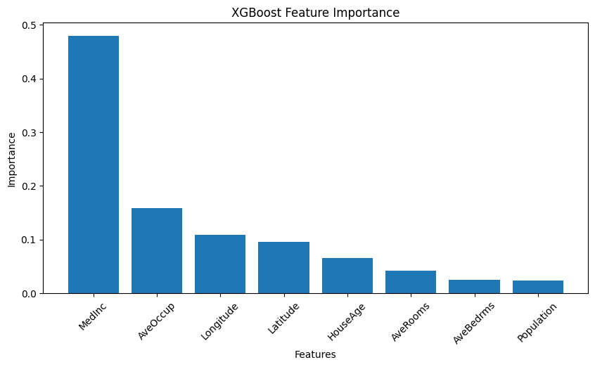
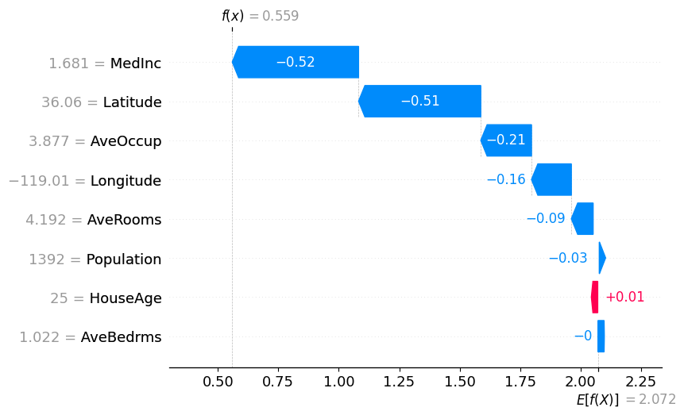

# 🏠 California House Price Prediction using XGBoost


An end-to-end Machine Learning project that predicts California house prices using the **California Housing Dataset**. The project compares multiple regression algorithms, performs hyperparameter tuning, explains model predictions using **SHAP (Explainable AI)**, and deploys the best-performing model through an interactive **Streamlit** web application.

---

# 📌 Project Overview

The objective of this project is to predict the median house value in California using housing-related features.

The project follows a complete Machine Learning workflow:

- Data Exploration
- Data Preprocessing
- Feature Analysis
- Model Training
- Model Comparison
- Hyperparameter Tuning
- Explainable AI (SHAP)
- Model Deployment using Streamlit

---

# 🚀 Features

✅ Data Cleaning & Preprocessing

✅ Exploratory Data Analysis (EDA)

✅ Comparison of Multiple Regression Models

✅ Hyperparameter Tuning using GridSearchCV

✅ Explainable AI using SHAP

✅ Model Serialization using Joblib

✅ Interactive Streamlit Web Application

---

# 📊 Dataset

**Dataset:** California Housing Dataset

**Source:** Scikit-Learn

### Input Features

- Median Income
- House Age
- Average Rooms
- Average Bedrooms
- Population
- Average Occupancy
- Latitude
- Longitude

### Target Variable

- Median House Value

---

# 🛠 Technologies Used

- Python
- Pandas
- NumPy
- Matplotlib
- Scikit-Learn
- XGBoost
- SHAP
- Joblib
- Streamlit

---

# 🤖 Machine Learning Models Compared

| Model | Purpose |
|--------|----------|
| Linear Regression | Baseline Model |
| Ridge Regression | Regularized Linear Regression |
| Lasso Regression | Feature Selection |
| Decision Tree | Non-linear Regression |
| Random Forest | Ensemble Learning |
| Gradient Boosting | Boosting Algorithm |
| XGBoost | Final Selected Model |

---

# 🏆 Best Model

After comparing all regression models, **XGBoost Regressor** achieved the best overall performance.

### Final Performance

| Metric | Score |
|--------|-------:|
| R² Score | **0.8367** |
| MAE | **0.3274** |
| RMSE | **0.4876** |

---

# ⚙ Hyperparameter Tuning

The XGBoost model was optimized using **GridSearchCV** with **5-Fold Cross Validation**.

### Best Parameters

```python
{
    "learning_rate": 0.1,
    "max_depth": 4,
    "n_estimators": 200
}
```

---

# 📈 Explainable AI (SHAP)

To improve model interpretability, SHAP (SHapley Additive Explanations) was used.

SHAP helps explain:

- Global Feature Importance
- Individual Prediction Explanations
- Positive and Negative Feature Contributions

---

# 📊 Feature Importance



---

# 🔍 SHAP Summary Plot


---

# 📉 SHAP Waterfall Plot



---

# 🌐 Streamlit Application

The trained XGBoost model is deployed using Streamlit.

Users can enter housing details and instantly predict California house prices.

---

## 🏠 Home Page


---

## 📈 Prediction Result


---

# 📂 Project Structure

```
California-House-Price-Prediction
│
├── app.py
├── house_price_xgboost.pkl
├── requirements.txt
├── README.md
│
├── data/
│
├── notebooks/
│   └── house_price_prediction.ipynb
│
├── images/
│   ├── home_page.png
│   ├── prediction.png
│   ├── feature_importance.png
│   ├── shap_beeswarm.png
│   └── shap_waterfall.png
```

---

# ▶ Installation

Clone the repository

```bash
git clone https://github.com/haneef333/<YOUR_REPOSITORY_NAME>.git
```

Move into the project directory

```bash
cd <YOUR_REPOSITORY_NAME>
```

Create a virtual environment (Optional)

```bash
python -m venv .venv
```

Activate the environment

### Windows

```bash
.venv\Scripts\activate
```

### Linux / macOS

```bash
source .venv/bin/activate
```

Install the required packages

```bash
pip install -r requirements.txt
```

Run the Streamlit application

```bash
streamlit run app.py
```

---

# 💡 Future Improvements

- Deploy on Streamlit Community Cloud
- Add Batch Predictions using CSV Upload
- Improve UI using Custom CSS
- Add Interactive Visualizations
- Support Multiple Regression Models inside the App

---

# 🎯 Key Learnings

This project helped me gain hands-on experience in:

- Regression Algorithms
- Ensemble Learning
- Hyperparameter Tuning
- Explainable AI (SHAP)
- Model Serialization
- Machine Learning Deployment
- Building Interactive ML Applications

---

# 👨‍💻 Author

## Mohammed Haneef

**B.E. Computer Science (AI & ML)**

- 🌐 GitHub: https://github.com/haneef333
- 💼 LinkedIn: https://www.linkedin.com/in/mohammed-haneef-655154306

---

## ⭐ If you found this project helpful, consider giving it a Star!